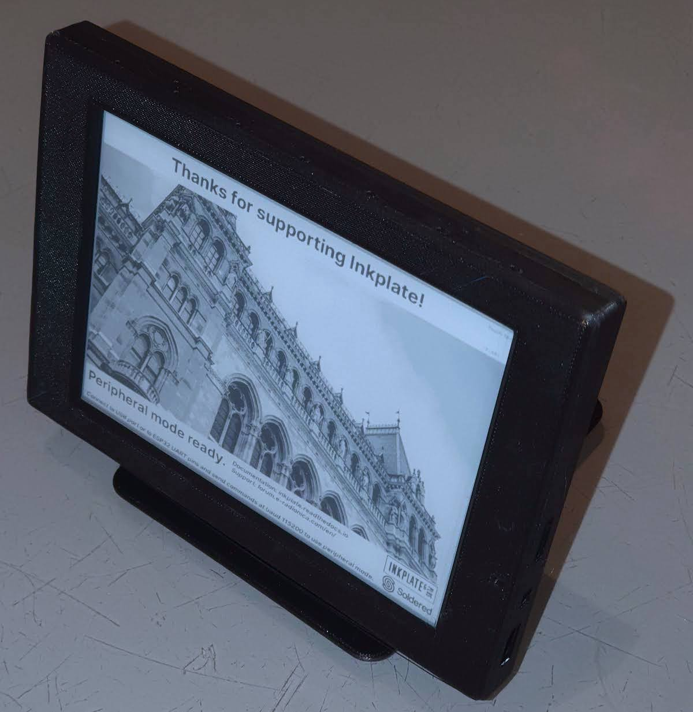
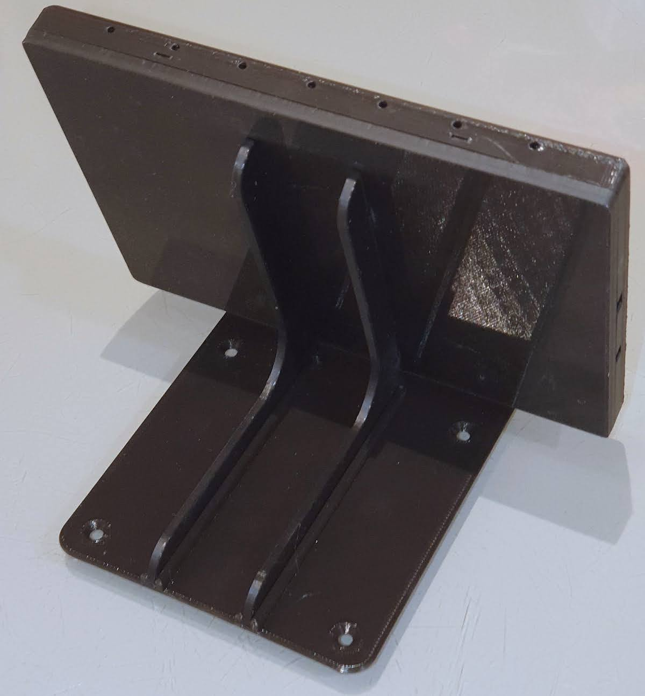

### Snap case and brackets for Inkplate 6+

Another case design for the Inkplate 6+. This case requires no screws, instead the cover snaps onto the base. Mounting
as designed is via 4 slots in the back, and there are accompanying brackets for wall or desk mounting.

The test example was printed in PLA on a Makergear M3 printer. Supports are not required except for the wall
bracket.

The Fusion360 source file is included, along with .3mf files for all components. Note that for the desk stand
two of the "Desk mount bracket" pieces are required.

